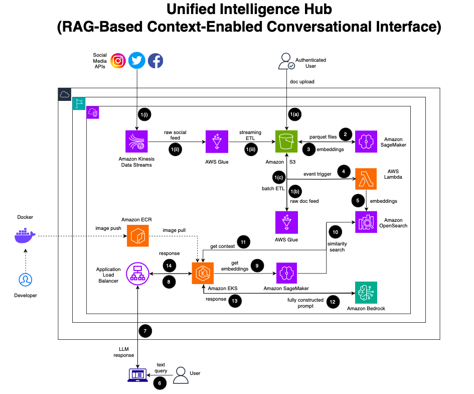

# Unified Intelligence Hub (UIH)

UIH is a RAG-based system that, amongst many things, improves the search intelligence, increases employee productivity, enhances decision-making, and customer experience of an organization.

## Solution Architecture

## Business Case
- This solution is designed for a large organization that needs to unify two distinct but equally valuable streams of knowledge: internal, structured/unstructured documents and external, real-time public conversations. The business case is to create a single, authoritative, and intelligent search interface that empowers the entire organization.

    - For Executive Leadership & Strategy: Instead of waiting for weekly reports, leaders can ask, "What is the current public sentiment on our new ESG policy, and how does it align with our internal mission statement on corporate responsibility?" The system synthesizes real-time Twitter/social data with internal policy PDFs to provide a comprehensive, up-to-the-minute answer.

    - For Marketing & Corporate Communications: The team can move from reactive to proactive. They can query, "Show me the top 3 customer complaints from social media in the last 24 hours and cross-reference them with the known issues section of the product manual for 'Model X'." This allows for rapid, accurate public responses and identifies gaps in documentation.

    - For Product Development & R&D: Engineers can validate ideas against real-world feedback. A query like, "Users are requesting a 'dark mode' feature on social media. What technical constraints are mentioned in our mobile app's original design specification documents?" bridges the gap between customer desire and technical feasibility.

    - Scalability and Future-Proofing: By using services like Kinesis, Glue, and SageMaker Batch Transform, the architecture is built to handle petabyte-scale data. It can ingest millions of social media posts and terabytes of internal documents without performance degradation, ensuring the solution grows with the organization. This "data lakehouse" approach also allows for other analytics and business intelligence workloads to run on the same processed data, maximizing its value.

## Phases

### Phase 1: Data Ingestion & Processing
This phase is about collecting raw data from different sources, processing it, converting it into numerical representations (embeddings), and indexing it for search. It operates as four distinct, sequential sub-stages that start with two parallel data-sourcing branches.

#### Stage 1, Branch A: Social Media Ingestion (Streaming)

This branch is designed for handling high-volume, real-time data.

Start Point: The flow begins outside the AWS cloud with Social Media APIs (e.g., X/Twitter, Meta/Facebook).

Flow: These APIs continuously push data as JSON Events.

**Component 1**: Amazon Kinesis Data Streams

Description: A regional service that acts as the entry point. A Kinesis Data Stream named social-media-stream is provisioned.

Action: It ingests the stream of JSON events from the Social Media APIs.

Flow: The raw data stream is forwarded from Kinesis.

**Component 2**: AWS Glue Streaming ETL

Description: A serverless streaming ETL job within AWS Glue.

Action: It continuously reads the data stream from Kinesis in micro-batches. The Glue job's script normalizes the JSON (e.g., extracts id, text, user fields) and converts the data format.

Flow: The transformed data is written out.

Endpoint: The flow for this branch terminates by saving the cleaned data as Parquet files into a specific folder within an Amazon S3 Bucket. The S3 path is s3://your-bucket/processed/social/.

#### Stage 1, Branch B: Departmental Uploads Ingestion (Batch)

This branch is designed for processing internal company documents that are added periodically.

Start Point: The flow begins with Departmental Users inside the organization.

Flow: Users upload documents (e.g., PDFs, DOCX, CSV files).

**Component 1**: Amazon S3 Bucket (Raw)

Description: A specific folder within the S3 bucket is designated for raw uploads.

Action: It receives and stores the uploaded documents at the path s3://your-bucket/raw/depts/. The arrival of a new object can act as a trigger.

Flow: The S3 event (a new file upload) triggers the next component.

**Component 2**: AWS Glue Batch ETL

Description: A serverless batch ETL job within AWS Glue. This job can be scheduled to run periodically (e.g., nightly) or triggered by the S3 event.

Action: The Glue job crawls the specified S3 path, opens the various document formats, extracts the raw text content, and converts the output.

Flow: The extracted and cleaned text is written out.

Endpoint: The flow for this branch terminates by saving the processed text as Parquet files into a different folder within the same S3 bucket: s3://your-bucket/processed/depts/.

#### Stage 2: Convergence - Embedding Generation

At this stage, the two parallel branches converge to a single processing step.

Start Point: This stage begins with the two sets of processed Parquet files residing in the S3 bucket at /processed/social/ and /processed/depts/.

Flow: Both S3 locations serve as the input for a single job.

Component: Amazon SageMaker Batch Transform

Description: A managed, large-scale batch processing job. This is not a real-time endpoint but a job that starts, runs on a defined number of instances (e.g., ml.g4dn.xlarge), and then terminates.

Action: It reads all the Parquet files from both input folders. For each row of text, it invokes a pre-trained text embedding model. This model converts the textual data into a high-dimensional vector (a numerical representation).

Flow: The output of the model—a dataset containing the original text, the source, and the newly generated vector embedding—is written back to S3.

Endpoint: The stage concludes with the new Parquet files, now containing the embeddings, being saved to the S3 path s3://your-bucket/embeddings/output/.

#### Stage 3: Vector Indexing

This final stage of processing makes the generated embeddings searchable.

Start Point: The completion of the SageMaker Batch Transform job.

Flow: The job completion event triggers the next component via Amazon EventBridge.

**Component 1**: AWS Lambda

Description: A serverless function that runs in response to the trigger. It is configured to run within your Virtual Private Cloud (VPC) to have network access to the OpenSearch collection.

Action: The Lambda function reads the Parquet files containing the embeddings from the /embeddings/output/ S3 path. It then connects to Amazon OpenSearch and performs a bulk-indexing operation.

Flow: The function sends the embeddings, along with their associated text and source metadata, to be indexed.

Endpoint/Component 2: Amazon OpenSearch Service

Description: A serverless collection configured as a vector database. A specific index within this collection, named rag-index, is configured with a k-Nearest Neighbors (k-NN) mapping to handle vector similarity searches.

Action: It receives the data from Lambda and populates the k-NN index, making the vectors searchable. This component is persistent and holds the final, queryable data.

### Phase 2: Query & Response
This phase describes the real-time user interaction, from asking a question to receiving a generated answer. This entire phase operates within a highly available VPC spanning multiple Availability Zones.

Start Point: An End User on a client application (e.g., a web browser, Slack client, or mobile app).

Flow: The user submits a query, which is sent as an HTTPS Request.

**Component 1**: Application Load Balancer (ALB)

Description: A regional AWS service that serves as the public entry point to the application. It is deployed across at least two Availability Zones for high availability.

Action: It accepts the incoming HTTPS query and terminates the TLS. It then forwards the traffic to the backend service.

Flow: The request is forwarded as internal VPC traffic.

**Component 2**: Amazon EKS (Elastic Kubernetes Service) Cluster

Description: A managed Kubernetes cluster deployed across multiple AZs within the VPC. The cluster runs the application logic.

Action: The ALB routes traffic to the appropriate service running on the cluster.

Flow: Inside the cluster, the request is directed to a specific pod.

**Component 3**: Chat API Service Pod

Description: A containerized application running within an EKS pod. Multiple replicas of this pod exist across different AZs for resilience.

Action: This is the core of the query logic. It orchestrates the entire RAG process, which involves a sequence of five distinct internal steps:

Step 3a (Query OpenSearch): The service takes the user's text query, converts it into an embedding (by calling the real-time SageMaker endpoint), and sends a Similarity Search request to the Amazon OpenSearch index rag-index.

Step 3b (Receive Context): Amazon OpenSearch responds with the Top-K most relevant documents (the text chunks whose embeddings are closest to the query's embedding).

Step 3c (Construct Prompt): The service takes these retrieved text chunks and "stitches" them into a detailed prompt template, combining the retrieved context with the user's original question.

Step 3d (Call LLM): The fully constructed prompt is sent via an API call to the Amazon Bedrock LLM (e.g., Anthropic Claude 3). Amazon Bedrock is a regional service accessed securely from within the VPC via a VPC Endpoint.

Step 3e (Receive Answer): Bedrock processes the prompt and returns a Generated Answer back to the Chat API Service.

Flow: The final, generated answer is sent as an HTTPS response from the Chat API Service back to the ALB.

Flow: The ALB forwards the response back out to the internet.

Endpoint: The End User's client application receives the response and displays the answer.